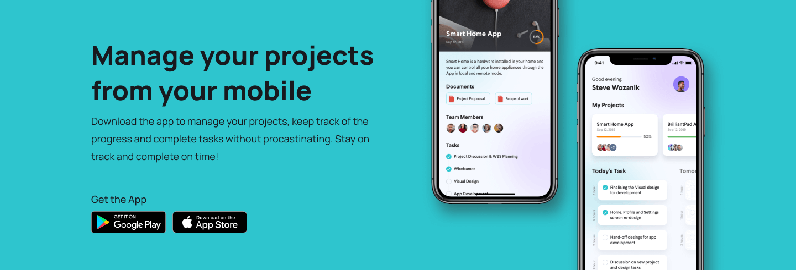
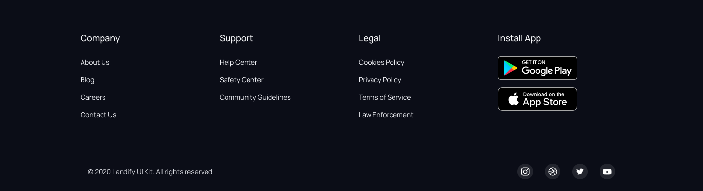

# Landify Home Page

Home Page For Landify
<a href="https://festive-turing-ef39c7.netlify.app/">Deploy</a>

---

## Table of Contents

- [Landify Home Page](#landify-home-page)
  - [Table of Contents](#table-of-contents)
  - [Installation](#installation)
  - [Features](#features)
  - [Usage](#usage)
  - [Documentation](#documentation)
  - [Contributing](#contributing)
    - [Step 1](#step-1)
    - [Step 2](#step-2)
    - [Step 3](#step-3)
  - [Team](#team)
  - [https://github.com/Charliemur2](#httpsgithubcomcharliemur2)
  - [Support](#support)
  - [License](#license)

---

## Installation

Clone the repositoy on your local computer.

---

## Features

Navbar and Hero section

Clouds section

Features sections

Testimonial section

CTA section

Footer and mini-footer section

---

## Usage

After clone the repository you can see the home page in the browser with index.html file. Make changes and test things on it.

## Documentation

<a href="https://9elements.com/bem-cheat-sheet/">`BEM CheatSheet`</a> 
<a href="https://sparkbox.com/foundry/bem_by_example">`BEM examples`</a> 
<a href="https://css-tricks.com/strategies-for-cache-busting-css/">`CSS cache`</a> 
<a href="https://learn-the-web.algonquindesign.ca/topics/html-semantics-cheat-sheet/">`HTML semantic`</a> 
<a href="https://developer.mozilla.org/en-US/docs/Web/Accessibility">`Accesibility`</a> 

---

## Contributing

> To get started...

### Step 1

- **Option 1**

  - 🍴 Fork this repo!

- **Option 2**
  - 👯 Clone this repo to your local machine.

### Step 2

- **HACK AWAY!** 🔨🔨🔨

### Step 3

- 🔃 Create a new pull request.

---

## Team

## https://github.com/Charliemur2

## Support

Feel free to contact me!

- GitHub at <a href="https://github.com/Charliemur2">`Charliemur2`</a>
- Twitter at <a href="https://twitter.com/charliesoka">`@charliesoka`</a>
- LinkedIn at <a href="https://www.linkedin.com/in/carlos-andres-murcia-munoz/">

---

## License

Free Source Code
